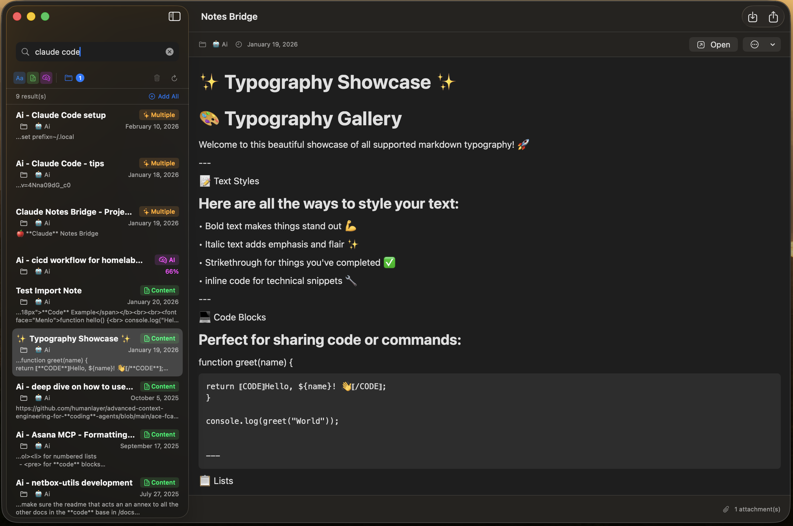
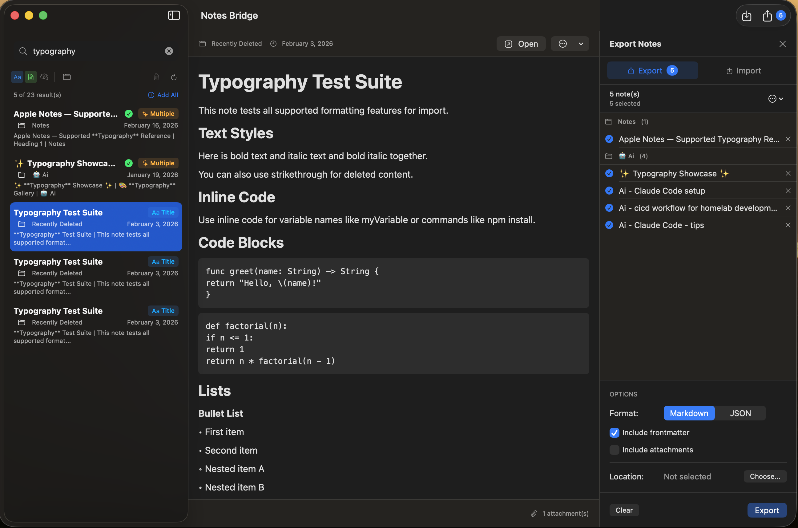

# Claude Notes Bridge

A native macOS MCP server that gives Claude full access to your Apple Notes — read, write, search, organize, import, and export.

Built in Swift. Zero runtime dependencies. Works with iCloud sync.

[](LICENSE) []() []()

## Features

- **Full CRUD** — Create, read, update, and delete notes. Markdown in, rich text out.
- **Smart Search** — Full-text search (FTS5, 3000x faster than scanning) and AI-powered semantic search with on-device MiniLM embeddings. No API keys needed.
- **Folder Management** — Create, rename, move, and delete folders. Nested folders supported.
- **Attachments** — Read attachment metadata, extract files, add new attachments to notes.
- **Import & Export** — Markdown (with YAML frontmatter) and JSON. Single notes or batch operations with folder structure preserved.
- **Search UI** — Standalone SwiftUI app with real-time search, rich text preview, and import/export interface.

  

- **CLI** — Search, list, read, and manage notes from your terminal with colored output.
- **iCloud Safe** — Reads directly from the database (fast), writes through Apple Notes via AppleScript (reliable). Your iCloud sync stays intact.

## Quick Start

### 1. Install

#### Option A: Download (Recommended)

Download the latest `.pkg` installer from [GitHub Releases](https://github.com/lasmarois/claude-notes-bridge/releases/latest).

The installer includes both the CLI tool and the Notes Search app. Open the `.pkg` and follow the prompts.

> **Note:** The binary is built for Apple Silicon (ARM64). Intel Macs should build from source.

#### Option B: Build from Source

```bash
git clone https://github.com/lasmarois/claude-notes-bridge.git
cd claude-notes-bridge
swift build -c release
```

### 2. Grant Full Disk Access

The bridge reads Apple Notes' SQLite database directly, so it needs Full Disk Access:

1. Open **System Settings** > **Privacy & Security** > **Full Disk Access**
2. Click the **+** button
3. Add your terminal app (e.g., Terminal, iTerm2, or Warp)
4. Restart your terminal

### 3. Add to Claude Code

Create or edit `.mcp.json` in your project directory:

```json
{
  "mcpServers": {
    "apple-notes": {
      "command": "/path/to/claude-notes-bridge",
      "args": ["serve"]
    }
  }
}
```

Replace `/path/to/claude-notes-bridge` with the actual path to the built binary (e.g., `.build/release/claude-notes-bridge`).

That's it. Claude can now read and write your Apple Notes.

## MCP Tools

**Reading & Searching:**

| Tool | Description |
|------|-------------|
| `list_notes` | List notes, optionally filtered by folder or account |
| `read_note` | Read full note content with metadata and attachments |
| `search_notes` | Keyword search with folder and date range filters |
| `build_search_index` | Build the FTS5 full-text index for fast search |
| `semantic_search` | Find semantically similar notes using AI embeddings |

**Writing & Organizing:**

| Tool | Description |
|------|-------------|
| `create_note` | Create a note (supports Markdown formatting) |
| `update_note` | Update note content |
| `delete_note` | Delete a note |
| `create_folder` | Create a new folder (nested supported) |
| `move_note` | Move a note to a different folder |
| `rename_folder` | Rename a folder |
| `delete_folder` | Delete a folder |

**Attachments & Import/Export:**

| Tool | Description |
|------|-------------|
| `get_attachment` | Extract an attachment from a note |
| `add_attachment` | Add a file as an attachment to a note |
| `export_note` | Export a note to Markdown or JSON |
| `import_note` | Import a note from Markdown or JSON |

## CLI Usage

```bash
# Search notes
claude-notes-bridge search "meeting notes"

# List all notes
claude-notes-bridge list

# Read a specific note
claude-notes-bridge read <note-id>

# List folders
claude-notes-bridge folders

# Export a note to Markdown
claude-notes-bridge export <note-id> --format markdown

# Import from Markdown
claude-notes-bridge import notes.md

# Start MCP server (used by Claude Code)
claude-notes-bridge serve
```

Run `claude-notes-bridge --help` for all options.

## Search UI

A standalone SwiftUI app for visual note searching with real-time results.



### Build & Run

```bash
swift build --product notes-search

# Create signed app bundle (required for Full Disk Access)
mkdir -p .build/NotesSearch.app/Contents/MacOS
cp .build/debug/notes-search .build/NotesSearch.app/Contents/MacOS/NotesSearch
codesign --force --deep --sign - .build/NotesSearch.app
open .build/NotesSearch.app
```

> **Note:** You'll need to add `NotesSearch.app` to **Full Disk Access** in System Settings before it can read your notes.

- **Real-time search** — FTS and semantic search as you type
- **Rich preview** — Formatted text, tables, attachments
- **Import/Export** — Drag-and-drop import, batch export with folder structure
- **Keyboard-driven** — Navigate results without touching the mouse

## How It Works

Claude Notes Bridge uses a hybrid architecture for reliability:

- **Reads** go directly to the SQLite database (~5ms per note) for speed
- **Writes** go through AppleScript (~300ms) to keep iCloud sync intact

```
Claude Code ──stdio──► claude-notes-bridge
                           │
                           ├── SQLite ──► NoteStore.sqlite (reads)
                           └── AppleScript ──► Notes.app (writes → iCloud)
```

Direct database reads are fast and don't disturb Notes.app. AppleScript writes ensure every change flows through Apple's sync pipeline, so your notes stay consistent across all your devices.

## Requirements

- macOS 13 (Ventura) or later
- Swift 5.9+ (included with Xcode 15+)
- Full Disk Access permission

## Contributing

Contributions are welcome! Please open an issue to discuss your idea before submitting a pull request.

```bash
git clone https://github.com/lasmarois/claude-notes-bridge.git
cd claude-notes-bridge
swift build
swift test
```

## License

MIT — see [LICENSE](LICENSE) for details.
